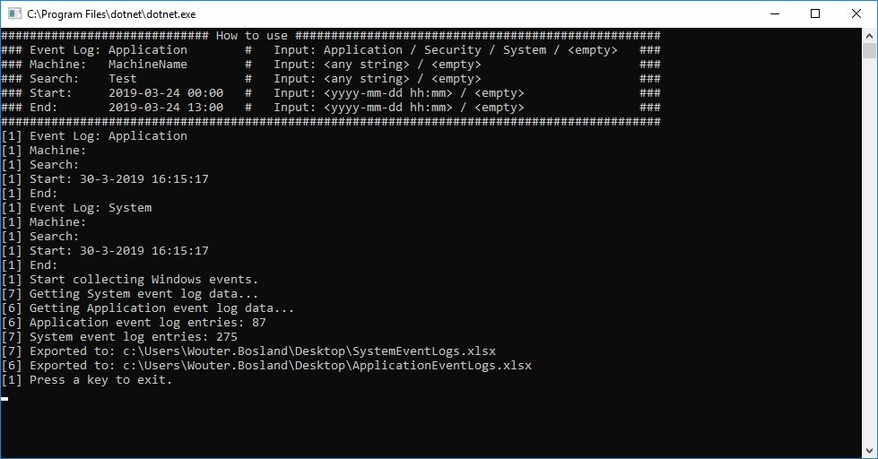

# Windows Event Collector

# Features

- Search events by:
  - Event Log (Application, System or Security)
  - Machine (local or remote)
  - Search (simple string.Contains('...'))
  - Start Date
  - End Date
- Collect and export events to Excel
- Collect multiple event logs concurrently
- Auto collect on startup
